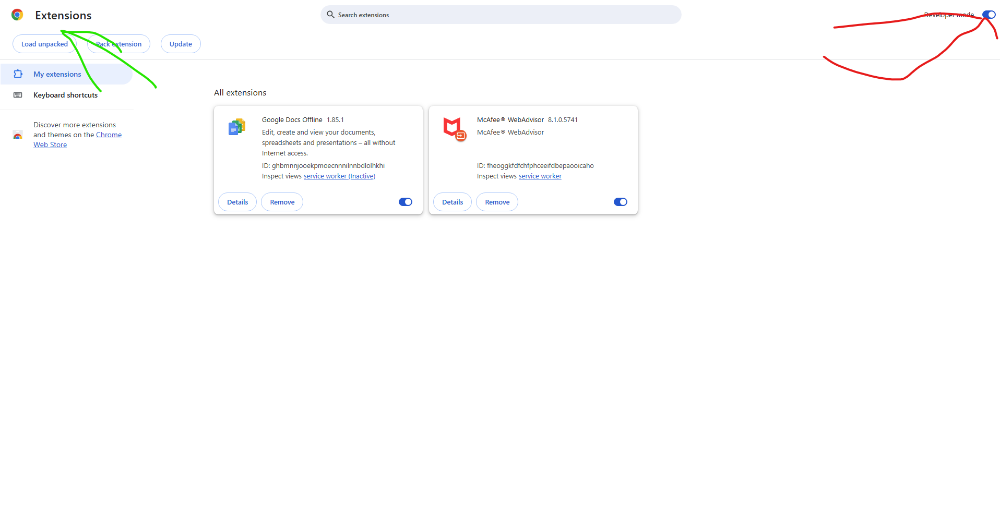
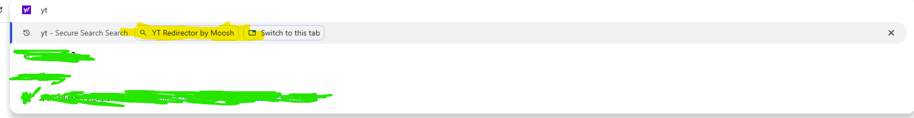

# Installation Guide

[**View Usage Guide**](#usage-guide) *(small text)*

### Downloading: Download and extract the Extension

So first go to releases and download the latest Zip File, then unzip it.

### Step 1: Activate Developer Mode

To activate Developer Mode, follow the red arrow in the image below.

### Step 2: Load Unpacked Extension

After activating Developer Mode, click "Load Unpacked" by following the green arrow in the image.

### Step 3: Select Extension Folder

Select the extension folder that you just unzipped, then click "Select Folder".

### Compatible Browsers

You can use the extension on the following browsers:
- [Google Chrome Extensions Page](chrome://extensions/)

---

# Usage Guide

### Step 1: Search "yt" in the Search Bar

Search for "yt" in the search bar, and this should pop up. If not, please follow the installation guide again or make an issue.

### Step 2: Click Tab, Then Space

Click the Tab key, then the Space key to proceed.

### Step 3: Enjoy YouTube!

Yay! Now you're at YouTube.
